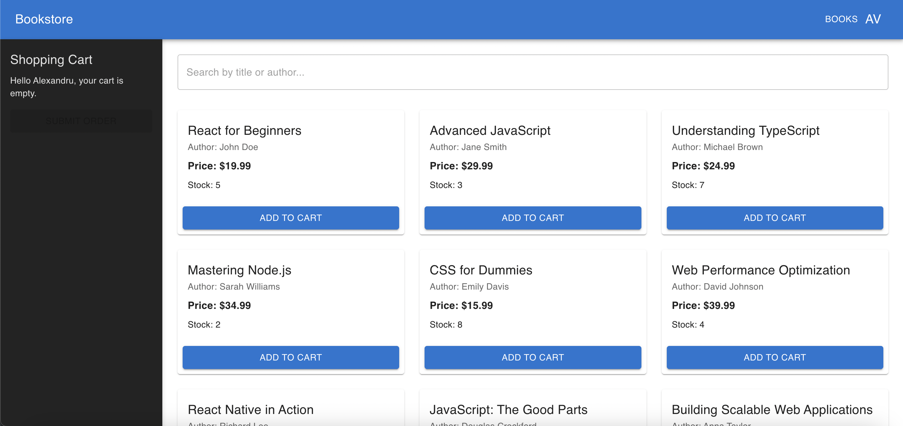
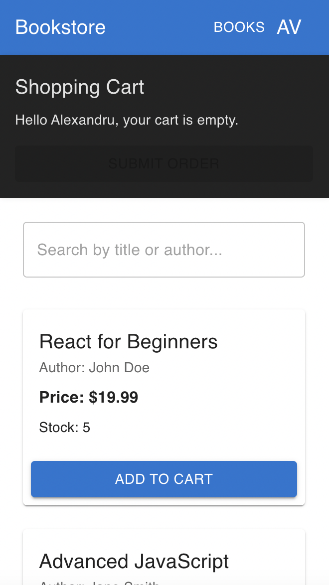

# Bookstore Application




## Description

A React-based application for managing user profiles and browsing books. Features include a searchable book list, a shopping cart with stock management, and a profile page where users can update their personal details.

## Structure/Architecture

- Components: Reusable UI elements like Navbar and Sidebar.
- Pages: BooksPage for browsing books and ProfilePage for user management.
- Context: UserContext for user data and CartContext for shopping cart state.
- Styling: Material-UI for dynamic, responsive, and accessible designs.

## Technical Choices

- React Context API: Simplified global state management for users and the cart.
- React Router: Enables client-side routing for seamless navigation between pages.
- Vite: Chosen for its fast development server and optimized build process, ensuring a better developer experience and quick reloads.
- Material-UI: Provides prebuilt components for a consistent design system.
- TypeScript: Ensures type safety and scalability.

## Trade-offs and Future Enhancements

- Backend Integration: Currently uses mock data; a real backend would enable persistence and real-time updates.
- Error Handling: Basic error feedback; could be improved with centralized notifications.
- Testing: Limited tests; adding unit and integration tests would increase reliability.
- Advanced Features: Accessibility enhancements, better animations, and performance optimization could improve user experience.

With more time, backend integration, comprehensive testing, and advanced error handling would make this application production-ready.

Run project on local:

```js
pnpm run dev
```
